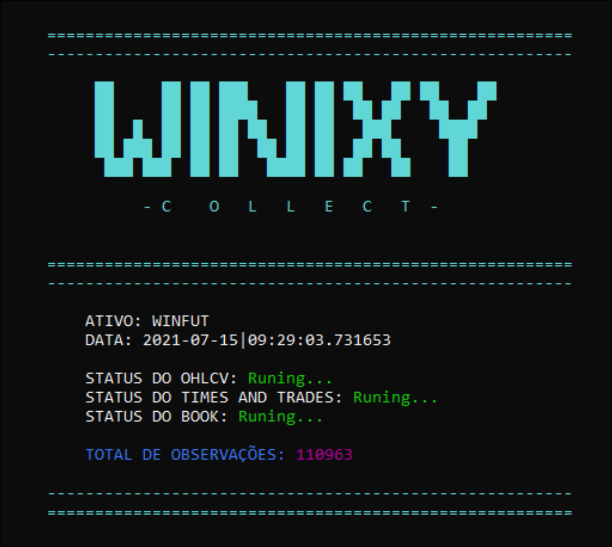
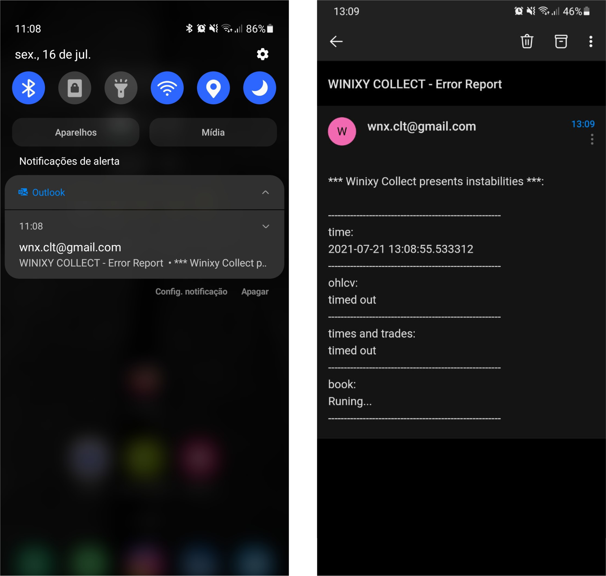

<h1 align="center">
   
  
    
</h1>

# **Descrição:**
O **WINIXY COLLECT** é um sistema de coleta de dados da bolsa de valores brasileira, a Brasil, Bolsa, Balcão (B3). Sendo assim, tem como função coletar dados em tempo real e dentro de uma janela de tempo mais rápida que os segundos.

## **Área de aplicação:**
Mercado financeiro e de capitais, investimentos e outros.

## **Problema:**
Coletar dados de ativos em tempo real para fazer análises de investimentos no mercado de capitais.

## **Abordagem do problema:**
A coleta de dados ocorre através da utilização de linguagem Python para se conectar com uma plataforma de investimentos, onde essa fornece os dados em tempo real. O sistema acessa esse servidor disponibilizado pela plataforma, coleta e envia os dados para uma data base.

## **Processos da aplicação:**
Essa coleta de informações ocorre separadamente, uma função salva os dados passados do ativo selecionado, faz um pré processamento e envia essas informações para uma tabela de banco de dados relacional local, o mesmo ocorre em relação ao times and trades e por último uma outra função é executada em um processo paralelo para armazenar informações do book de ofertas do ativo e atualizar um arquivo csv local. Também, o sistema foi programado para funcionar apenas no horário definido, no caso o horário em que o mercado está aberto, e para ser desligado nos finais de semana, em sábados e domingos.

## **Algumas métricas:**

Quantidade de observações geradas por hora:
Mais de **8.000** mil linhas de informações.

Quantidade de observações geradas por dia:
Mais de **60.000** mil linhas de informações.

Quantidade de observações geradas por mês:
Mais de **1.2 milhões** de linhas de informações.

Quantidade de observações geradas por ano:
Mais de **15 milhões** de linhas de informações.

> Informações para testes realizados em um computador desktop de configuração mediana. Esses números podem aumentar ainda mais caso seja utilizado uma máquina mais robusta.

 

# **Demonstração**

## **Módulo para monitorar o status e ter um feedback visual das informações básicas:**
    

## **Relatórios e notificações por email:**

    

## **Winixy Collect funcionando:**
Em breve...

 

# **Avaliação do projeto:**
A coleta de dados ocorreu como o esperado, a aplicação conseguiu fazer a capturação das informações dentro da janela dos segundos e em tempo real. Porém, deve-se levar em consideração algumas limitações, como por exemplo, a conexão com o servidor que ocorre pelo protocolo TCP, causando assim uma certa lentidão por causa da ocorrência do Three-way Handshake, seria mais interessante se o servidor aceitasse o protocolo UDP.

Apesar disso, a coleta de dados da bolsa de valores brasileira através do Winixy Collect é bastante eficiente. Conseguiu-se atingir o objetivo principal do projeto, a partir desses dados coletados será estimado modelos de predição de preços de ativos do mercado financeiro utilizando estatística para algoritmos de machine learning.

## **Utilização:**
É necessário um estudo prévio para descobrir como a plataforma de interesse irá disponibilizar a conexão ou API para receber os dados da bolsa em tempo real. Também, cada plataforma disponibiliza sua ordem e tipo das tabelas, isso demanda um estudo e será útil para a criação do banco de dados, todas as configurações estão alocadas no arquivo "configs.py", depois de tudo ajustado é só executar o arquivo "connect.py".
